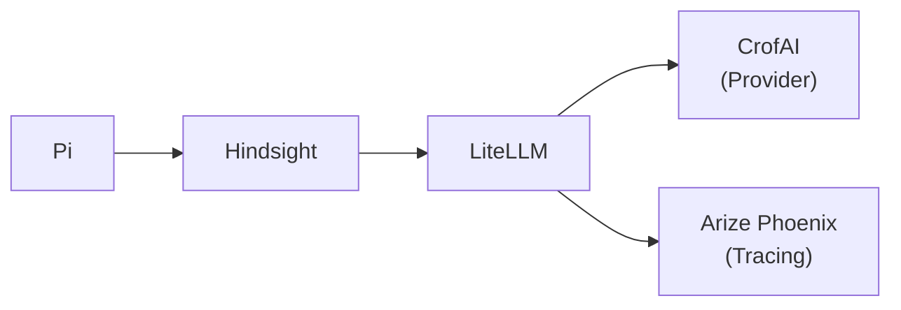

# Nailed It!

[English](./README.md) | **한국어**

완벽? 💯 카오스? 🤡  
Harry의 AI 에이전트 환경.

## 시스템 아키텍처



## 왜 이 프로젝트를 시작했나요?

### 배경

현재(2026.05) 시점의 LLM API는 기억 기능이 없습니다.
입력으로 제공된 문맥에 따라서 결과를 출력할 뿐입니다.

그렇기 때문에 에이전트 하네스에서는 일반적으로 아래와 같은 구성으로 입력을 조립합니다.
- 페르소나 및 핵심 지침 (e.g. 당신은 OpenAI의 GPT 5.5입니다.)
- Tools 카탈로그 (e.g. read: 파일을 읽을때 사용합니다.)
- [Agent Skills](https://agentskills.io/) 카탈로그 (e.g. [andrej-karpathy-skills](https://github.com/multica-ai/andrej-karpathy-skills))
- AGENTS.md (또는 CLAUDE.md; 사용자 수준의 핵심 지침)
- 현재 대화 세션(a.k.a 스레드; Tool 호출 및 결과 포함)

기억시키고 싶은 내용이 있다면 에이전트 하네스 구성에 추가해야 합니다.
사용자 수준에서 제일 효과가 좋은 것은 AGENTS.md와 Agent Skills입니다.
AGENTS.md는 실행시 항상 포함되기 때문에 프로젝트 수준의 지침을 포함하기 좋습니다.
반면에 Agent Skills는 특정 상황에서만 포함되기 때문에 전문화된 작업 수준의 지침을 작성하기 좋습니다.
예를 들어 API 구현이나 DB 쿼리 작성 가이드라인이 있습니다.
AI 주제를 벗어나서 일반적인 오픈소스 기여, 코딩 규약, 신규 입사자 온보딩, 특정 작업 가이드와 같은 기존의 문서화 작업과 사실상 같습니다.
문서화하기 쉬운 내용은 AGENTS.md, Agent Skills에 작성하는 것이 좋습니다.

하지만 주제를 불문하고 내용이 방대한 경우는 AGENTS.md, Agent Skills로 작성하기 어렵습니다.
어려운 이유는 크게 2가지가 있습니다.

첫번째로 LLM API의 문맥은 한정된 크기를 갖고 있습니다.
모델마다 편차가 있지만 한국어 기준으로 약 단행본 1권 분량 정도가 최대입니다.
그리고 출력도 같은 문맥에 작성되므로 출력을 위한 공간도 필요합니다.

두번째로 문맥 오염 현상이 있습니다.
문맥 내 지침이나 논리가 모순되거나 특정 행동에 대한 편향적인 내용이 있으면 사용자의 의도와 다른 결과를 얻을 수도 있습니다.
문맥이 방대할수록 이런 현상이 발생할 확률이 증가합니다.
예를 들어, 한 세션에서 작업 요청 후 커밋 요청을 10회 진행한 후에 같은 세션에서 작업 요청시 커밋을 하지 말라고 해도 커밋 실수를 할 확률이 있습니다.
왜냐면 한 세션에서 지속적으로 커밋을 요청했었기 때문입니다.
일반적으로 기획/설계/구현에 대한 번복이 문맥에 같이 있으면 좋지 않습니다.

AGENTS.md, Agent Skills와 같은 적은 분량의 문서로 해결하기 어려운 경우는 문서 검색과 유사한 시스템이 필요합니다.

### 문제 정의

평상시에 질의/탐구/경험해서 획득한 지식들을 AI와 공유하기가 쉽지 않습니다.
파편화된 지식들을 문서화하는 것은 시간적 인적 비용면에서 수지타산이 맞지 않다고 생각했습니다.
그래서 개인적인 경험을 모두 에이전트 하네스를 통해서 하면 자연스럽게 지식을 누적하고 AI와 공유할 수 있을 것이라는 가정 하에 이 프로젝트를 시작했습니다.

## 어떻게 기능을 구현했나요?

크게 3가지 핵심 구성요소를 사용했습니다.
[Hindsight](https://hindsight.vectorize.io/), [Pi](https://pi.dev/) 그리고 [Hermes Agent](https://hermes-agent.nousresearch.com/)입니다.

### [Hindsight](https://hindsight.vectorize.io/)

Hindsight는 장기 기억 시스템입니다.
기억 질의시 4가지의 방법(Semantic, Keyword (BM25), Graph, Temporal)을 병렬로 실행하고 그 결과를 RRF Fusion, Cross Encoding 처리한 후 결과를 반환합니다.
Semantic 구성은 한국어 지원이 필요했기 때문에 Hindsight 공식 다국어 임베딩 추천 모델인 [BAAI/bge-m3](https://huggingface.co/BAAI/bge-m3)를 사용했습니다.
Keyword (BM25) 구성도 마찬가지로 한국어 지원이 필요했기 때문에 추천 백엔드인 [vchord](https://github.com/supervc-stack/VectorChord-bm25)를 사용했습니다. 내부적으로 [llmlingua2](https://llmlingua.com/) 토크나이저를 사용합니다.


### [Pi](https://pi.dev/)

### [LiteLLM](https://docs.litellm.ai/)

### [CrofAI](https://crof.ai/)

### [Arize Phoenix](https://arize.com/docs/phoenix)


## My Environment

- macOS 26.4
- brew
- bash
- tmux
- uv 0.11
- pnpm 11
- Python 3.14
- Node.js 24
- PostgreSQL 18

## Install Dependencies

```sh
uv sync --all-packages

# tree-sitter requires C++20
CXXFLAGS=-std=c++20 pnpm i
```

## Run Servers

```sh
tmux new -s nailed-it uv run dev-cli serve
```

## 설정

```sh
# 서브모듈 초기화
uv run dev-cli setup git-submodules

# PostgreSQL 확장 설치
uv run dev-cli setup pg-config

# LiteLLM for Hindsight
uv run dev-cli setup ll-hs

# Hindsight API
uv run dev-cli setup hs-api

# Hindsight Web
uv run dev-cli setup hs-web
```

## 구조

```
python-packages/
├── dev-cli/                        # CLI 도구 (Python)
│   └── src/dev_cli/commands/
│       ├── setup/                  # 개발 환경 설정
│       │   ├── git_submodules.py   # 서브모듈 초기화
│       │   ├── hermes_config.py    # Hermes Agent 설정
│       │   ├── hs_api.py           # Hindsight API (uv tool)
│       │   ├── hs_web.py           # Hindsight Web (npm global)
│       │   ├── ll_hs.py            # LiteLLM for Hindsight (uv tool)
│       │   ├── opencode_config.py  # OpenCode 설정
│       │   ├── pg_config.py        # PostgreSQL 확장 설치
│       │   ├── pi_config.py        # Pi Coding Agent 설정
│       │   └── global_skills.py    # 전역 스킬 심볼릭 링크
│       └── models_dev.py           # models.dev API 조회
└── nailed-it-hermes/               # Hermes Agent 플러그인

packages/
├── pi/                     # Pi Coding Agent 확장 모음
│   └── extensions/
│       ├── activate-skill.ts   # 스킬 활성화
│       ├── bash.ts             # bash 실행
│       ├── elapsed-time.ts     # 경과 시간 표시
│       ├── fd.ts               # fd 검색
│       ├── find.ts             # find 검색
│       ├── gh.ts               # GitHub CLI
│       ├── grep.ts             # grep 검색
│       ├── hindsight.ts        # 장기기억 (retain/recall)
│       ├── ls.ts               # ls 파일 목록
│       ├── max-tokens.ts       # 모델별 max_tokens 설정
│       ├── notify.ts           # 시스템 알림
│       ├── rg.ts               # ripgrep 검색
│       ├── tavily.ts           # Tavily 검색 및 추출
│       ├── temperature-zero.ts # temperature 0 설정
│       ├── usages.ts           # 사용량 조회
│       ├── web-fetch.ts        # 웹 페이지 페치
│       └── web-search.ts       # 웹 검색

skills-src/
├── memory/                      # Hindsight 장기기억
└── tavily/                      # Tavily 검색 및 추출

external/
├── langfuse/           # Langfuse observability (docker compose)
├── hermes-agent/       # Hermes Agent (서브모듈)
├── VectorChord/        # 벡터 검색 pg extension
├── VectorChord-bm25/   # BM25 pg extension
└── pg_tokenizer.rs/    # 토크나이저 pg extension
```

## CLI 도구

```sh
# 전체 CLI
uv run dev-cli --help

# 개발 환경 설정
uv run dev-cli setup --help

# 서브모듈 클론 및 업데이트
uv run dev-cli setup git-submodules

# Hermes Agent (venv 생성 → 의존성 설치 → config/plugin/명령어 링크)
uv run dev-cli setup hermes-config

# LiteLLM for Hindsight (uv tool)
uv run dev-cli setup ll-hs

# Hindsight API (uv tool)
uv run dev-cli setup hs-api

# Hindsight Web (npm global)
uv run dev-cli setup hs-web

# OpenCode 설정 파일 링크
uv run dev-cli setup opencode-config

# PostgreSQL 확장 빌드 및 설치 (VectorChord, pg_tokenizer, bm25)
uv run dev-cli setup pg-config

# Pi Coding Agent 설정 파일 링크 + 패키지 설치
uv run dev-cli setup pi-config

# 전역 스킬 심볼릭 링크 (skills-src/ → ~/.agents/skills/)
uv run dev-cli setup global-skills

# models.dev API에서 프로바이더/모델 정보 조회
uv run dev-cli models-dev providers
uv run dev-cli models-dev models openai
uv run dev-cli models-dev model openai gpt-4o
```

## 라이선스

MIT
